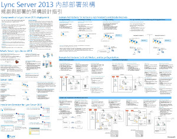
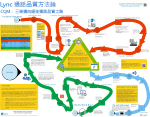
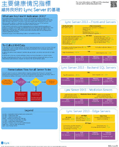
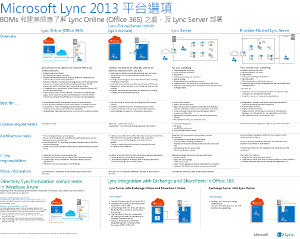

---
title: Lync Server 2013 技術圖表
TOCTitle: 技術圖表
ms:assetid: 7b6da49b-ac72-4ab0-8957-166e330b38fa
ms:mtpsurl: https://technet.microsoft.com/zh-tw/library/Dn594589(v=OCS.15)
ms:contentKeyID: 61170926
ms.date: 08/10/2015
mtps_version: v=OCS.15
ms.translationtype: HT
---

# Lync Server 2013 的技術圖表

 

_**上次修改主題的時間：** 2015-03-09_

**摘要：** 這些圖提供 Lync 2013 建議解決方案的視覺表示。

這些資源以 Visio (.vsd) 格式 (Visio 2010 或 Visio 2013) 與 PDF 格式提供。如需有關如何列印文件的資訊，請參閱列印海報的提示。

您可能需要其他軟體才能檢視這些檔案。如需詳細資訊，請參閱下表。

<table>
<colgroup>
<col style="width: 50%" />
<col style="width: 50%" />
</colgroup>
<thead>
<tr class="header">
<th>檔案類型</th>
<th>軟體</th>
</tr>
</thead>
<tbody>
<tr class="odd">
<td>
.vsd
</td>
<td>
Visio 2010、Visio 2013 或<a href="http://go.microsoft.com/fwlink/?linkid=393676">免費 Visio 檢視程式</a>

如果您使用 Visio 檢視程式，請以滑鼠右鍵按一下 VSD 連結，按一下 <strong>[另存目標]</strong>，將檔案儲存至您的電腦，然後從電腦中開啟檔案。
</td>
</tr>
<tr class="even">
<td>
.pdf
</td>
<td>
任何 PDF 檢視程式，例如 <a href="http://go.microsoft.com/fwlink/?linkid=393675">Adobe Reader</a>
</td>
</tr>
<tr class="odd">
<td>
.zip
</td>
<td>
任何檔案壓縮公用程式。Windows 7 與 8 可原生開啟這些檔案。
</td>
</tr>
</tbody>
</table>

## 海報

這些海報詳細列出特定技術區域，主要與 TechNet 上的對應文章或可在下載中心找到的內容搭配使用。

<table>
<colgroup>
<col style="width: 50%" />
<col style="width: 50%" />
</colgroup>
<thead>
<tr class="header">
<th>標題</th>
<th>描述</th>
</tr>
</thead>
<tbody>
<tr class="odd">
<td>
<strong>Lync Server 2013 內部部署架構</strong>

<a href="http://go.microsoft.com/fwlink/?linkid=392974">使用 Microsoft 的 Zoom.it 將海報放大到最大</a> (最適合在桌上型電腦或筆記型電腦上)

<a href="http://go.microsoft.com/fwlink/?linkid=392578">PDF 版本</a> (最適合在行動裝置或平板電腦上)

<a href="http://go.microsoft.com/fwlink/?linkid=392579">Visio 版本</a> (最適合 Visio 使用者)
</td>
<td>
海報提供規劃與部署的架構指導方針。海報中包含有關 Lync Server 一般元件的資訊、規劃部署、新功能、伺服器角色與安裝概觀時所使用的術語。此外，海報中還包含增加高可用性與災害復原，以及小、中與大型範例拓撲的範例架構。

大小：34X44 英吋

此海報使用 Visio 2013 建立。特定環境下無須修改。
</td>
</tr>
<tr class="even">
<td>
<strong>Lync 通話品質方法</strong>

<a href="http://go.microsoft.com/fwlink/?linkid=392972">使用 Microsoft 的 Zoom.it 將海報放大到最大</a> (最適合在桌上型電腦或筆記型電腦上)

<a href="http://go.microsoft.com/fwlink/?linkid=391841">一起放在 .zip 檔案中的 Visio 與 PDF 版本</a>
</td>
<td>
描述 Lync 系統疑難排解的海報，特別有關影響企業語音品質的問題。請搭配以下項目使用此海報：

<ul>
<li>
<a href="http://go.microsoft.com/fwlink/p/?linkid=390677">Lync Server 網路指南</a>
</li>
<li>
<a href="lync-server-2013-poster-lync-call-quality-methodology.md">Lync Server 2013 中的 Lync 通話品質方法</a> (協助工具文章)
</li>
<li>
<a href="lync-server-2013-poster-key-health-indicators.md">Lync Server 2013 中的重要狀態指示器</a> (協助工具文章)
</li>
</ul>

大小：34X44 英吋

此海報使用 Visio 2010 建立。特定環境下無須修改。
</td>
</tr>
<tr class="odd">
<td>
<strong>重要狀態指示器</strong>

<a href="http://go.microsoft.com/fwlink/?linkid=392971">使用 Microsoft 的 Zoom.it 將海報放大到最大</a> (最適合在桌上型電腦或筆記型電腦上)

<a href="http://go.microsoft.com/fwlink/?linkid=391838">一起放在 .zip 檔案中的 Visio 與 PDF 版本</a>
</td>
<td>
針對 Lync 實作中的基本伺服器狀況與特定伺服器角色描述伺服器疑難排解計量的海報。請搭配以下項目使用此海報：

<ul>
<li>
<a href="http://go.microsoft.com/fwlink/p/?linkid=390677">Lync Server 網路指南</a>
</li>
<li>
<a href="lync-server-2013-poster-lync-call-quality-methodology.md">Lync Server 2013 中的 Lync 通話品質方法</a> (協助工具文章)
</li>
<li>
<a href="lync-server-2013-poster-key-health-indicators.md">Lync Server 2013 中的重要狀態指示器</a> (協助工具文章)
</li>
</ul>

大小：17X22 英吋

此海報使用 Visio 2010 建立。特定環境下無須修改。
</td>
</tr>
<tr class="even">
<td>
<strong>Lync 2013 平台選項</strong>

<a href="http://go.microsoft.com/fwlink/p/?linkid=391840">使用 Microsoft 的 Zoom.it 將海報放大到最大</a>

<a href="http://go.microsoft.com/fwlink/p/?linkid=391837">PDF 版本</a> (最適合在行動裝置或平板電腦上)

<a href="http://go.microsoft.com/fwlink/p/?linkid=391839">Visio 版本</a> (最適合 Visio 使用者)
</td>
<td>
此海報描述對於 BDM 與架構之 Lync 2013 的可用平台選項  客戶可以選擇 Lync Online 搭配 Office 365、混合 Lync、Lync Server 內部部署與主控 Lync。海報中包含每個架構選項的詳細資訊，包括對於每一個項目的最理想案例、授權需求與 IT Pro 責任。

大小：34X44 英吋

此海報使用 Visio 2013 建立。特定環境下無須修改。
</td>
</tr>
<tr class="odd">
<td>
<strong>Microsoft Lync Server 2013 通訊協定工作負載</strong>

<a href="http://go.microsoft.com/fwlink/?linkid=392970">使用 Microsoft 的 Zoom.it 將海報放大到最大</a>

<a href="http://go.microsoft.com/fwlink/?linkid=392512">PDF 版本</a> (最適合在行動裝置或平板電腦上)

<a href="http://go.microsoft.com/fwlink/?linkid=392513">Visio 版本</a> (最適合 Visio 使用者)
</td>
<td>
請下載此海報，了解 Lync 2013、Lync Phone、Lync Web App、Lync for Mac 與 Lync Mobile w 的功能與需求。了解 Lync Server 工作附載如何有利於整個組織中的通訊。

大小：24X36 英吋

此海報使用 Visio 2013 建立。特定環境下無須修改。
</td>
</tr>
</tbody>
</table>

## 列印海報的提示

如果您有繪圖機，您能夠以完整大小列印這些海報。如果您沒有繪圖機，請依照下列步驟使用較小紙張列印。

**在較小紙張上列印海報**

1.  在 Visio 中開啟海報。

2.  在 **\[檔案\]** 功能表上，按一下 **\[版面設定\]**。

3.  在 **\[設定列印格式\]** 索引標籤的 **\[印表機紙張\]** 部分，選取您要列印的紙張大小。

4.  在 **\[設定列印格式\]** 索引標籤的 **\[列印比例\]** 部分，按一下 **\[調整成\]**，然後輸入 **\[1 頁 X 1 頁\]**。

5.  在 **\[頁面大小\]** 索引標籤上，按一下 **\[大小符合繪圖內容\]**，然後按一下 **\[確定\]**。

6.  在 **\[檔案\]** 功能表上，按一下 **\[列印\]**。

